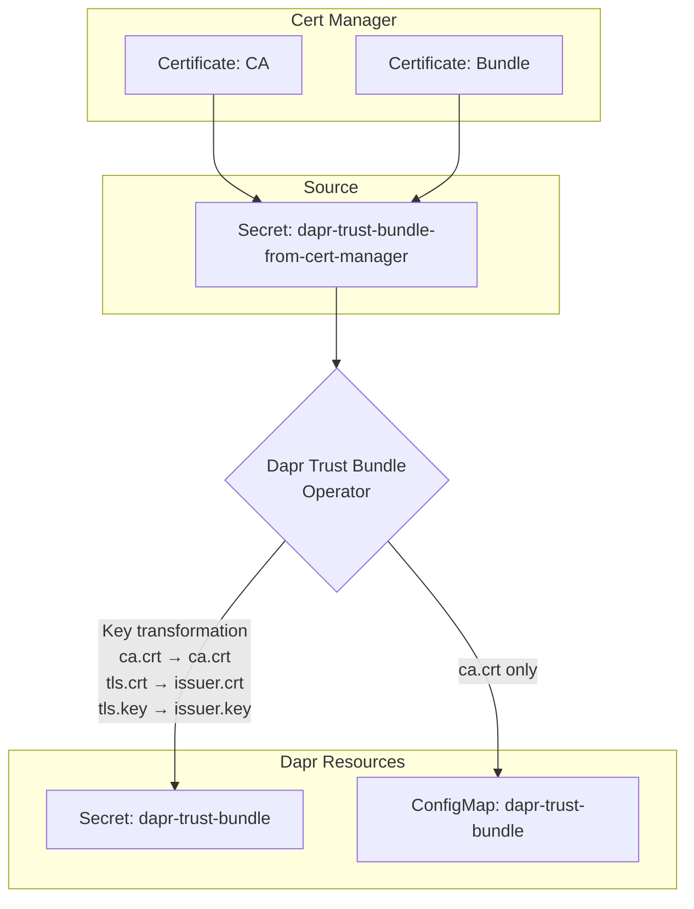

# Dapr Trust Bundle Operator

A Kubernetes operator that bridges the gap between cert-manager and Dapr's trust bundle requirements, enabling automated certificate lifecycle management for Dapr environments.

## Overview

Cert-manager is the de facto standard for certificate management in Kubernetes, but it has strong opinions about secret formats and key names that don't align with Dapr's trust bundle expectations. This operator solves that compatibility issue by automatically transforming cert-manager secrets into Dapr-compatible trust bundles.

## How It Works

The operator monitors a source secret (typically generated by cert-manager) and automatically creates and maintains a Dapr-compatible trust bundle:

1. **Watches** for changes to the source secret (default: `dapr-trust-bundle-from-cert-manager`)
2. **Transforms** the certificate data with proper key renaming:
   - `ca.crt` → `ca.crt` (unchanged)
   - `tls.key` → `issuer.key`
   - `tls.crt` → `issuer.crt`
   - Other keys are copied as-is
3. **Creates** both a secret and configmap named `dapr-trust-bundle`
4. **Maintains** synchronization and handles cleanup automatically



## Quick Start

### Install with Helm (Recommended)

```bash
# Add and install the Helm chart
helm install dapr-trustbundle deploy/helm/dapr-trustbundle

# Or install from source
git clone https://github.com/elenpay/dapr-trustbundle.git
cd dapr-trustbundle
helm install dapr-trustbundle deploy/helm/dapr-trustbundle
```

### Install with kubectl

```bash
# Install the latest release
kubectl apply -f https://github.com/elenpay/dapr-trustbundle/releases/latest/download/install.yaml

# Or use the installation script
curl -sSL https://raw.githubusercontent.com/elenpay/dapr-trustbundle/main/scripts/install.sh | bash
```

### Verify Installation

```bash
# Check operator status
kubectl get pods -n dapr-system -l control-plane=operator

# Create a test secret in the dapr-system namespace
kubectl apply -f examples/test-secret.yaml -n dapr-system

# Verify the trust bundle was created
kubectl get secret,configmap dapr-trust-bundle -n dapr-system
```

## Configuration

### Command Line Flags

The operator supports the following configuration flags:

| Flag                          | Default                               | Description                                  |
| ----------------------------- | ------------------------------------- | -------------------------------------------- |
| `--source-secret-name`        | `dapr-trust-bundle-from-cert-manager` | Name of the source secret to monitor         |
| `--target-namespace`          | `dapr-system`                         | Namespace to monitor and create resources in |
| `--leader-elect`              | `false`                               | Enable leader election for high availability |
| `--metrics-bind-address`      | `:8443`                               | Address for the metrics endpoint             |
| `--health-probe-bind-address` | `:8081`                               | Address for health and readiness probes      |

### Helm Configuration

```yaml
# Custom source secret and namespace
controller:
  sourceSecretName: "my-cert-secret"
  targetNamespace: "production"

rbac:
  useClusterRole: false # Use namespace-scoped permissions
```

### RBAC Modes

The operator supports two RBAC modes depending on your deployment method:

#### Cluster-wide RBAC (Kustomize Default)

- **Used by**: `make deploy` (kustomize)
- Grants cluster-wide permissions to manage secrets and configmaps
- Suitable for monitoring multiple namespaces
- Uses ClusterRole and ClusterRoleBinding

#### Namespace-scoped RBAC (Helm Default - Enhanced Security)

- **Used by**: Helm chart with `rbac.useClusterRole: false` (default)
- Restricts permissions to the target namespace only
- Uses specific resource names for fine-grained access control
- Automatically configures namespace-scoped caching to prevent cluster-wide resource listing
- Recommended for production environments monitoring a single namespace

## RBAC Permissions

The operator requires different permissions based on the deployment mode:

### Cluster-wide RBAC (default)

- `get`, `list`, `watch` on secrets (to monitor source secrets in any namespace)
- `create`, `update`, `patch`, `delete` on secrets and configmaps (to manage target resources)

### Namespace-scoped RBAC (enhanced security)

- `get`, `list`, `watch` on specific source secret by name (e.g., `dapr-trust-bundle-from-cert-manager`)
- `create`, `delete`, `patch`, `update` on secrets and configmaps (for resource creation)
- `get`, `list`, `watch`, `patch`, `update` on `dapr-trust-bundle` secret and configmap specifically
- `update` on finalizers and status for specific secrets only

### RBAC Modes

#### Cluster-wide RBAC

- Grants cluster-wide permissions to manage secrets and configmaps
- Suitable for monitoring multiple namespaces

#### Namespace-scoped RBAC (Default for Enhanced Security)

- Restricts permissions to the target namespace only
- Uses specific resource names for fine-grained access control
- Automatically configures namespace-scoped caching to prevent cluster-wide resource listing
- Recommended for production environments monitoring a single namespace

## Installation Methods

### Helm Chart

**Basic Installation:**

```bash
helm install dapr-trustbundle deploy/helm/dapr-trustbundle
```

**Production Installation:**

```bash
helm install dapr-trustbundle deploy/helm/dapr-trustbundle \
  --set replicaCount=2 \
  --set resources.limits.memory=256Mi \
  --set metrics.serviceMonitor.enabled=true \
  --set podDisruptionBudget.enabled=true
```

**Custom Configuration:**

```bash
helm install dapr-trustbundle deploy/helm/dapr-trustbundle \
  --set controller.sourceSecretName="custom-cert-secret" \
  --set controller.targetNamespace="custom-namespace" \
  --set rbac.useClusterRole=false
```

### Manifest Files

```bash
# Latest stable release
kubectl apply -f https://github.com/elenpay/dapr-trustbundle/releases/latest/download/install.yaml

# Development version
kubectl apply -f https://raw.githubusercontent.com/elenpay/dapr-trustbundle/main/deploy/install.yaml
```

### Installation Script

```bash
# Quick install
curl -sSL https://raw.githubusercontent.com/elenpay/dapr-trustbundle/main/scripts/install.sh | bash

# Install and test
curl -sSL https://raw.githubusercontent.com/elenpay/dapr-trustbundle/main/scripts/install.sh | bash -s -- --test
```

## Usage Examples

### Basic Usage with cert-manager

1. **Create a cert-manager Certificate:**

```yaml
apiVersion: cert-manager.io/v1
kind: Certificate
metadata:
  name: dapr-trust-bundle-cert
  namespace: dapr-system
spec:
  secretName: dapr-trust-bundle-from-cert-manager
  issuerRef:
    name: ca-issuer
    kind: ClusterIssuer
  commonName: dapr-trust-bundle
  dnsNames:
    - dapr-trust-bundle
```

2. **The operator automatically creates:**

- `Secret/dapr-trust-bundle` with transformed keys
- `ConfigMap/dapr-trust-bundle` with CA certificate only

### Testing the Operator

```bash
# 1. Create a test secret in the dapr-system namespace
kubectl apply -f examples/test-secret.yaml -n dapr-system

# 2. Verify target resources were created
kubectl get secret dapr-trust-bundle -n dapr-system -o yaml
kubectl get configmap dapr-trust-bundle -n dapr-system -o yaml

# 3. Test automatic updates
kubectl patch secret dapr-trust-bundle-from-cert-manager -n dapr-system \
  -p '{"data":{"new-key":"bmV3LXZhbHVl"}}'

# 4. Verify the changes were propagated
kubectl get secret,configmap dapr-trust-bundle -n dapr-system -o yaml

# 5. Monitor operator logs
kubectl logs -n dapr-system -l control-plane=operator -f
```

## Development

### Prerequisites

- Go 1.24.0+
- Docker 17.03+
- kubectl 1.11.3+
- Kind (recommended for local development)

### Development Workflow

```bash
# Clone the repository
git clone https://github.com/elenpay/dapr-trustbundle.git
cd dapr-trustbundle

# Create a dedicated Kind cluster for this project
kind create cluster --name dapr-trustbundle

# Set kubectl context to the new cluster
kubectl cluster-info --context kind-dapr-trustbundle

# Build and load the operator image into the Kind cluster
make docker-build
kind load docker-image dapr-trustbundle-operator:latest --name dapr-trustbundle

# Deploy the operator (choose one method)

# Option 1: Deploy with Helm (Recommended - namespace-scoped RBAC by default)
helm upgrade --install dapr-trustbundle deploy/helm/dapr-trustbundle \
  --namespace dapr-system \
  --create-namespace \
  --set image.repository=dapr-trustbundle-operator \
  --set image.tag=latest \
  --set image.pullPolicy=Always

# Option 2: Deploy with kustomize (cluster-wide RBAC)
make kind-deploy

# Run tests
make test
```

### Testing Changes

```bash
# Apply example secret in the dapr-system namespace
kubectl apply -n dapr-system -f examples/test-secret.yaml

# Check operator logs
kubectl logs -n dapr-system -l control-plane=operator -f

# Clean up
kind delete cluster --name dapr-trustbundle
```

For more details take a look to [./examples/README.md](./examples/README.md)

### CI/CD Pipeline

This project includes GitHub Actions workflows for automated building and releasing:

- **Linting** (`.github/workflows/lint.yml`):

  - Runs `golangci-lint` to check Go code for style and correctness issues

- **Testing** (`.github/workflows/test.yml`):

  - Runs unit tests and integration tests
  - Ensures code changes do not break existing functionality

- **End-to-End Testing** (`.github/workflows/test-e2e.yml`):

  - Deploys the operator to a test cluster
  - Runs end-to-end tests against the deployed operator

- **Docker Build & Push** (`.github/workflows/docker-build-push.yml`):
  - Triggers on pushes to `main` branch and tag creation
  - Builds multi-platform Docker images (linux/amd64, linux/arm64)
  - Pushes to GitHub Container Registry (`ghcr.io`)
  - Generates deployment manifests as artifacts

**Image Tagging Strategy:**

- `main` - Latest development version from main branch
- `v1.0.0` - Stable release versions
- `pr-123` - Pull request builds for testing

### Project Structure

```
├── cmd/main.go                    # Application entry point
├── internal/controller/           # Controller implementation
├── config/                        # Kubernetes manifests
│   ├── default/                   # Default deployment
│   ├── rbac/                      # RBAC permissions
│   └── manager/                   # Manager deployment
├── deploy/                        # Distribution artifacts
│   ├── install.yaml               # Complete installation manifest
│   ├── helm/dapr-trustbundle/     # Helm chart
│   └── helm-packages/             # Packaged charts
├── examples/                      # Usage examples
├── scripts/install.sh             # Installation script
└── .github/workflows/             # CI/CD pipelines
```

## Troubleshooting

### Common Issues

1. **ImagePullBackOff**: Ensure you send the newly built image to your cluster, we use `make kind-load` that takes care of this
2. **RBAC errors**: Run `make manifests` and `make deploy` to update permissions
3. # **Secret not syncing**: Check operator logs and verify the source secret name matches exactly
   | Issue                                      | Cause                                                            | Solution                                                                                                                                                            |
   | ------------------------------------------ | ---------------------------------------------------------------- | ------------------------------------------------------------------------------------------------------------------------------------------------------------------- |
   | `ERROR: no nodes found for cluster "kind"` | Using named Kind cluster but make targets expect default cluster | Either use default cluster name (`kind create cluster`) or manually load image (`kind load docker-image dapr-trustbundle-operator:latest --name your-cluster-name`) |
   | `ImagePullBackOff`                         | Image not available in cluster                                   | Run `make kind-load` for Kind clusters                                                                                                                              |
   | RBAC errors                                | Insufficient permissions                                         | Run `make manifests deploy` to update RBAC                                                                                                                          |
   | `configmaps is forbidden at cluster scope` | Using namespace RBAC but operator tries cluster-wide access      | Ensure `rbac.useClusterRole: false` and operator will auto-configure namespace caching                                                                              |
   | Secret not syncing                         | Source secret name mismatch                                      | Verify `--source-secret-name` flag matches actual secret                                                                                                            |
   | Operator not starting                      | Configuration errors                                             | Check operator logs and verify flags                                                                                                                                |

### Debug Commands

```bash
# Check operator status
kubectl get pods -n dapr-system -l control-plane=operator

# View detailed logs
kubectl logs -n dapr-system -l control-plane=operator --tail=100

# Test RBAC permissions
kubectl auth can-i create secrets --as=system:serviceaccount:dapr-system:dapr-trustbundle-operator

# List all resources
kubectl get secrets,configmaps -n dapr-system | grep dapr-trust-bundle

# Check operator configuration
kubectl get deployment -n dapr-system -o yaml
```

### Health Checks

```bash
# Check health endpoint
kubectl port-forward -n dapr-system deployment/dapr-trustbundle-operator 8081:8081
curl http://localhost:8081/healthz

# Check metrics (if enabled)
kubectl port-forward -n dapr-system service/dapr-trustbundle-operator-metrics-service 8443:8443
curl -k https://localhost:8443/metrics
```

## CI/CD and Releases

### Automated Workflows

- **Linting**: Code quality checks with golangci-lint
- **Testing**: Unit and integration tests
- **E2E Testing**: Full deployment and functionality testing
- **Docker Build**: Multi-platform images (linux/amd64, linux/arm64)
- **Releases**: Automated GitHub releases with artifacts

### Image Tagging Strategy

- `main` - Latest development version
- `v1.0.0` - Stable release versions

### Available Images

```bash
# Latest development
ghcr.io/elenpay/dapr-trustbundle/dapr-trustbundle:main

# Stable releases
ghcr.io/elenpay/dapr-trustbundle/dapr-trustbundle:v1.0.0
```

## Contributing

1. Fork the repository
2. Create a feature branch
3. Make your changes
4. Add tests for new functionality
5. Run `make test lint`
6. Submit a pull request

### Development Guidelines

- Follow Go best practices and formatting
- Add tests for new features
- Update documentation for user-facing changes
- Ensure CI passes before submitting PRs

## License

Licensed under the Apache License, Version 2.0. See [LICENSE](LICENSE) for details.

---

For more detailed examples and advanced configuration, see the [`examples/`](examples/) directory and [Helm chart documentation](deploy/helm/dapr-trustbundle/README.md).
